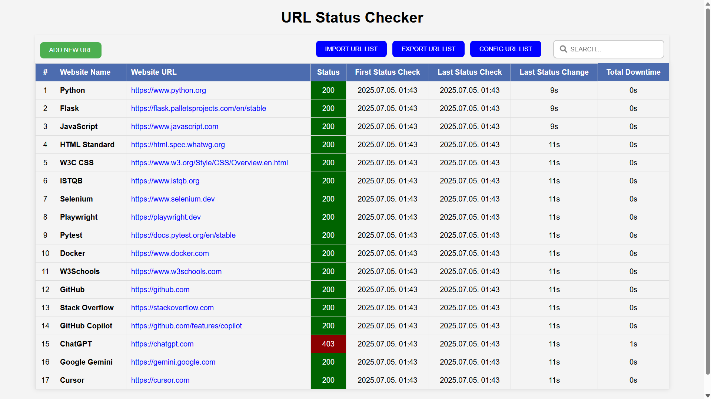

# URL Status Checker

## About the project

A web application for checking the status of URLs and API endpoints, displayed in a CRUD table.  
This is a proof of concept. Do not use it in production, it is not secure and does not handle errors properly.


<p align="center">
	
</p>

## Built with

[![Python][Python]][Python-url]
[![Flask][Flask]][Flask-url]
[![JavaScript][JavaScript]][JavaScript-url]
[![HTML5][HTML5]][HTML5-url]
[![CSS3][CSS3]][CSS3-url]

## Project Structure

```
url-status-checker/
├── app/                        # Main application package
│   ├── __init__.py             # Flask app factory
│   ├── routes.py               # Flask routes
│   ├── status_checker.py       # URL status checking and logging logic
│   ├── data/                   # Data files (e.g., url_registry.json)
│   │   ├── urls/               # Archived request result data
│   │   └── url_registry.json   # List of URLs to check
│   ├── static/                 # Static files (CSS, JS)
│   │   ├── css/
│   │   │   └── style.css       # Main stylesheet
│   │   └── js/
│   │       └── script.js       # Main frontend JavaScript
│   └── templates/              # HTML templates
│       └── index.html          # Main HTML template
├── logs/                       # Log files
│   ├── flask_error.log         # Flask error log
│   ├── flask_output.log        # Flask output log
│   └── requirements.log        # Dependency installation log
├── requirements.txt            # Python dependencies
├── run.py                      # Entry point to run the Flask app
├── start.ps1                   # Script to start the app locally (Windows)
├── .env.example                # Example environment variables
├── LICENSE                     # License file
├── README.md                   # Project documentation
└── .gitignore                  # Git ignore rules
```

## Prerequisites:

### Install latest Python

Don't forget to add Python path to the environment variables.
Minimum requirements Python 3.8

```
https://www.python.org/downloads/
```

## Getting Started

### 1. Clone GitHub repository

```
git clone https://github.com/supragub/url-status-checker.git
```

### 2. Run app in local

Windows:

```
powershell.exe -File start.ps1
```

### 3. Shutdown app in local

Windows:
```
To stop the app, open Windows Task Manager and end the process named "Python".
```

[Python]: https://img.shields.io/badge/python-3670A0?style=for-the-badge&logo=python&logoColor=ffdd54
[Python-url]: https://www.python.org/
[Flask]: https://img.shields.io/badge/flask-43B02A?style=for-the-badge&logo=flask&logoColor=white
[Flask-url]: https://flask.palletsprojects.com/
[JavaScript]: https://img.shields.io/badge/javascript-802045?style=for-the-badge&logo=javascript&logoColor=white
[JavaScript-url]: https://www.javascript.com/
[HTML5]: https://img.shields.io/badge/html5-ff5000?style=for-the-badge&logo=html5&logoColor=white
[HTML5-url]: https://html.spec.whatwg.org/
[CSS3]: https://img.shields.io/badge/css3-2496ED?style=for-the-badge&logo=css3&logoColor=white
[CSS3-url]: https://www.w3.org/Style/CSS/Overview.en.html